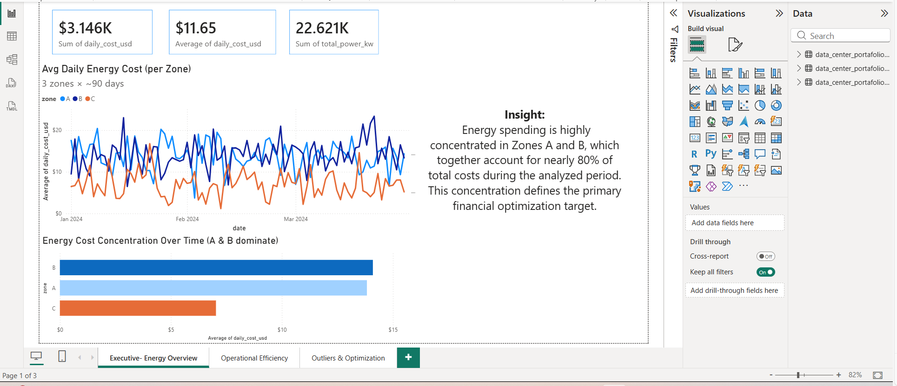
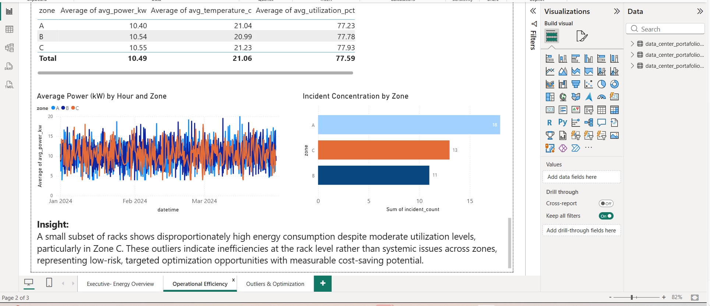
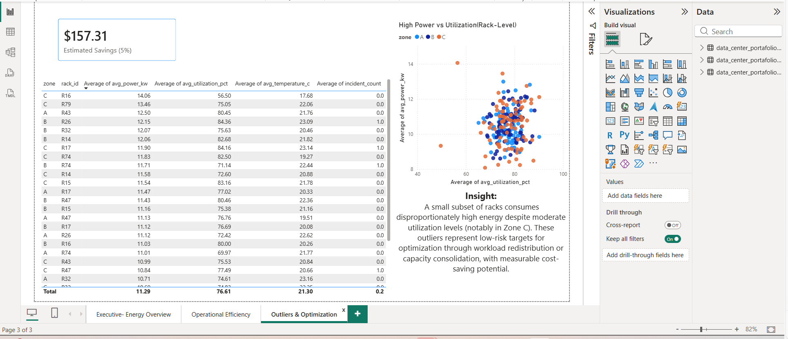

# Data Center Energy & Operations Analytics

End-to-end data analytics project focused on analyzing energy consumption, operational efficiency, and optimization opportunities in a simulated data center environment.

This project demonstrates how operational and financial data can be transformed into executive-level insights using a modern analytics stack.

---

## Tech Stack
- **MySQL** – staging tables, clean layer, analytics views (data mart)
- **Python** – ETL, data cleaning, validation
- **Power BI** – executive dashboards and operational analytics
- **Git & GitHub** – version control and portfolio publishing

---

## Dashboard Pages

### 1. Executive | Energy Overview
- Daily energy cost tracking
- Cost distribution by operational zone
- Identification of cost concentration drivers

### 2. Operational Efficiency
- Comparison of average power consumption, temperature, and utilization by zone
- Incident analysis to identify operational inefficiencies
- Focus on operational drivers rather than raw energy usage

### 3. Outliers & Optimization Targets
- Identification of top energy-consuming racks
- Rack-level analysis of power vs utilization
- Estimation of potential energy savings through targeted optimization

---

## Key Insights
- Energy costs are highly concentrated in Zones A and B, accounting for roughly 80% of total energy spend.
- Average power consumption and temperature remain stable across zones, indicating no systemic energy issues.
- Zone A shows a significantly higher number of incidents, suggesting operational inefficiencies rather than capacity constraints.
- A small subset of racks consumes disproportionately high energy despite moderate utilization levels, representing low-risk optimization opportunities.

---

## Project Structure

## Dashboard Preview

### Executive Overview

### Operational Efficiency

### Outliers & Optimization Targets

